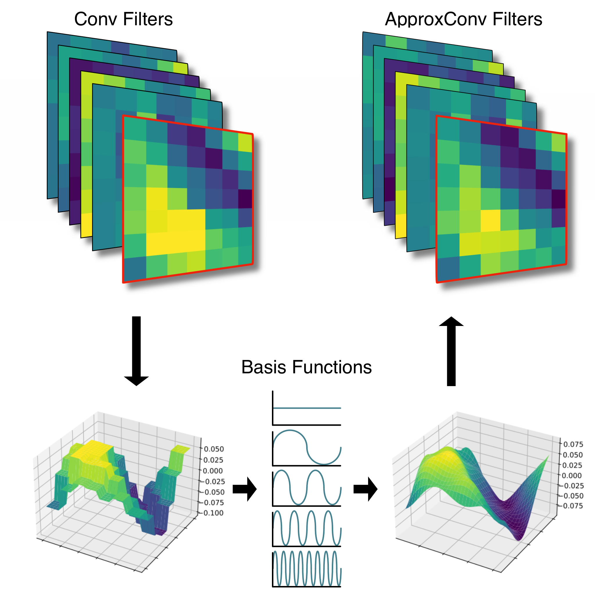

This is the landing page for paper **Approximating Continuous Convolutions for Deep Network Compression**.

## Abstract
We present ApproxConv, a novel method for compressing the layers of a convolutional neural network.
Reframing conventional discrete convolution as continuous convolution of parametrised functions over
space, we use functional approximations to capture the essential structures of CNN filters with fewer
parameters than conventional operations.
Our method is able to reduce the size of trained CNN layers requiring only a small amount of
fine-tuning.
We show that our method is able to compress existing deep network models by half whilst losing only
1.86% accuracy.
Further, we demonstrate that our method is compatible with other compression methods like quantisation
allowing for further reductions in model size.
## Code

The code for reproducing results in the paper can be obtained from the [GitHub repository](https://github.com/ActiveVisionLab/ApproxConv).

## Citation

BiBTeX:

```
@InProceedings{costain2022approximating,
    title={Approximating Continuous Convolutions for Deep Network Compression},
    author={Theo W. Costain and Victor A. Prisacariu},
      booktitle = {BMVC},
      month = {November},
      year = {2022}
}
```